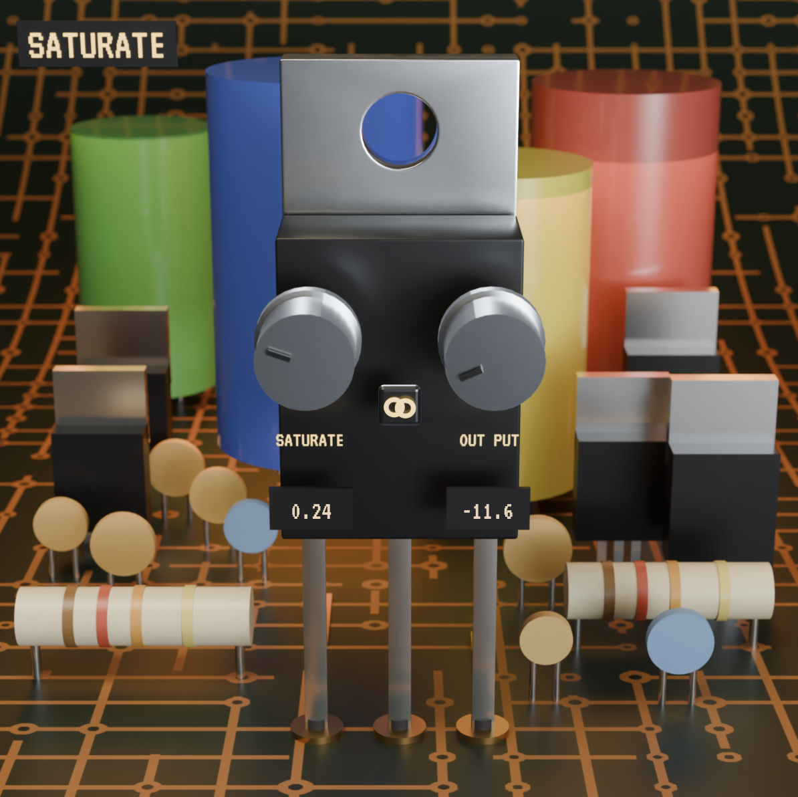

# Saturate

Saturate is an audio **saturator / drive** plugin built in C++ with the
[JUCE](https://juce.com) framework, with a custom hardware-style interface.
It compiles to **VST3**, **Audio Unit (AU)**, and **Standalone** on macOS.

<p align="center">
  
</p>

---

## Interface

The entire interface — faceplate, knobs, and Link button — was 3D-modelled and
rendered in **Blender**, driven programmatically from **Claude Code** through a
**Model Context Protocol (MCP)** bridge that lets the assistant control Blender
directly (modelling, materials, lighting, and rendering). Each knob is a 64-frame
filmstrip **rendered in place**, so its lighting and perspective match its position
on the board, and the knob bodies are baked into the faceplate for true contact
shadows and reflections. The live numeric readouts use a retro terminal font (VT323).

---

## Controls

### Drive
A waveshaping saturator. Each sample is shaped by the hyperbolic tangent function:

```
output = tanh(drive × input)
```

`tanh` is a smooth, S-shaped soft-clipping curve: near-linear for low-level signals
(clean) and progressively flattening toward ±1 as level rises, so peaks are rounded
rather than hard-clipped. Higher Drive pushes the signal onto the flatter shoulders,
generating more harmonics and more saturation. Displayed as **0.00–1.00**;
parameter-smoothed (50 ms, linear) to avoid zipper noise.

### Output
A makeup-gain trim (**±14 dB**, default 0 dB) applied *after* the waveshaper, so the
post-saturation level can be matched back to the input. Likewise smoothed (50 ms).

### Link
A chain-toggle that couples Drive and Output for **level-matched saturation**. When
engaged, raising Drive automatically lowers Output (and vice versa) along a
**measured loudness-compensation curve** — a K-weighted loudness profile of the
saturation stage — so perceived loudness stays roughly constant as you change the
amount of drive. Engaging Link preserves your current balance (the knobs don't jump),
and the state is saved with the project and reflected by the lit/unlit button.

---

## Signal chain

```
input → tanh(drive × input) → × outputGain → output
                                   ▲
                  Link ── couples Drive & Output (loudness-matched)
```

**Analog correspondence.** A symmetric `tanh` is the transfer function of a
bipolar-transistor differential pair, so this models solid-state soft clipping
directly. Its symmetry produces odd-order harmonics — similar in character to
push-pull and transistor saturation, and to the static transfer curve of tape. It
does **not** model single-ended valve warmth (even-order harmonics, which require an
asymmetric curve), tape hysteresis, or frequency-dependent behaviour, and it does
not yet oversample to suppress aliasing.

---

## Build

**Requirements**

- macOS (developed/tested on 14.7.8, Apple Silicon / arm64)
- [CMake](https://cmake.org) ≥ 3.22
- [Ninja](https://ninja-build.org) (build driver)
- [JUCE](https://github.com/juce-framework/JUCE) 8.x checked out locally
  (defaults to `~/JUCE`; override with `-DJUCE_PATH=/path/to/JUCE`)

**Configure and build**

```bash
cd Saturate
cmake -B build -G Ninja -DCMAKE_BUILD_TYPE=Debug
cmake --build build
```

On a successful build the plugin is copied into your user plugin folders
(`~/Library/Audio/Plug-Ins/...`) so it appears in your DAW immediately.

**Build outputs** (`Saturate/build/`, git-ignored):

- `Saturate.vst3` — cross-DAW VST3
- `Saturate.component` — Audio Unit (Logic, GarageBand)
- `Saturate.app` — Standalone app (easiest for quick testing)

---

## Layout

```
.
├── Saturate/
│   ├── CMakeLists.txt              # build recipe (juce_add_plugin + binary data)
│   ├── Resources/                  # embedded UI assets (ship inside the binary)
│   │   ├── background.png           #   faceplate, knob bodies + shadows baked in
│   │   ├── knob_L.png / knob_R.png  #   per-knob filmstrips (64 frames each)
│   │   ├── button_on.png / button_off.png  # Link toggle states
│   │   └── VT323-Regular.ttf        #   font for the live readouts
│   └── Source/
│       ├── PluginProcessor.{h,cpp} # DSP, parameters, and Link coupling
│       ├── PluginEditor.{h,cpp}    # the custom UI window
│       └── KnobLookAndFeel.{h,cpp} # filmstrip-knob renderer
├── .github/workflows/ci.yml        # CI build gate every PR must pass
├── .gitignore
└── README.md
```

The source is thoroughly commented, documenting the rationale behind each component
inline.

---

## Roadmap

- Oversampling to suppress aliasing at high Drive
- Unsigned macOS installer (`.dmg` / `.pkg`)
- Serial-number licensing

---

## Tech stack

- **Language:** C++17
- **Framework:** JUCE 8
- **Build:** CMake + Ninja
- **Audio formats:** VST3, AU, Standalone
- **CI:** GitHub Actions (macOS runner)
- **UI assets:** Blender (3D-modelled + rendered)
- **Tooling:** Claude Code, driving Blender via a Model Context Protocol (MCP) bridge

---

## Engineering workflow

`main` is protected. Each change flows through a short-lived feature branch, a pull
request, and a green CI build (configures + compiles the plugin in all formats on a
clean macOS runner) before it is merged.
